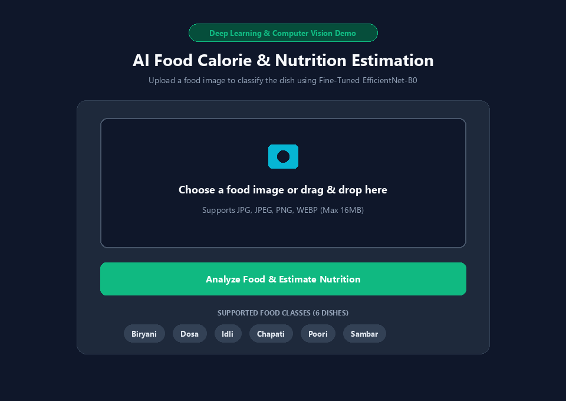
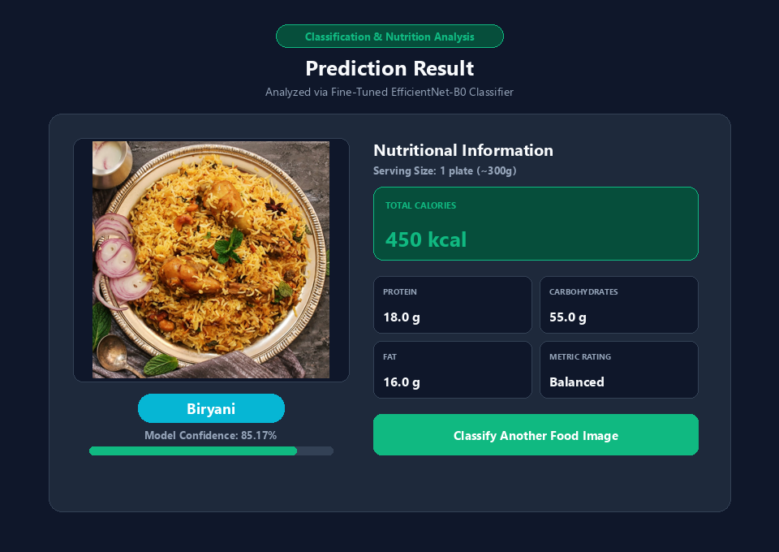
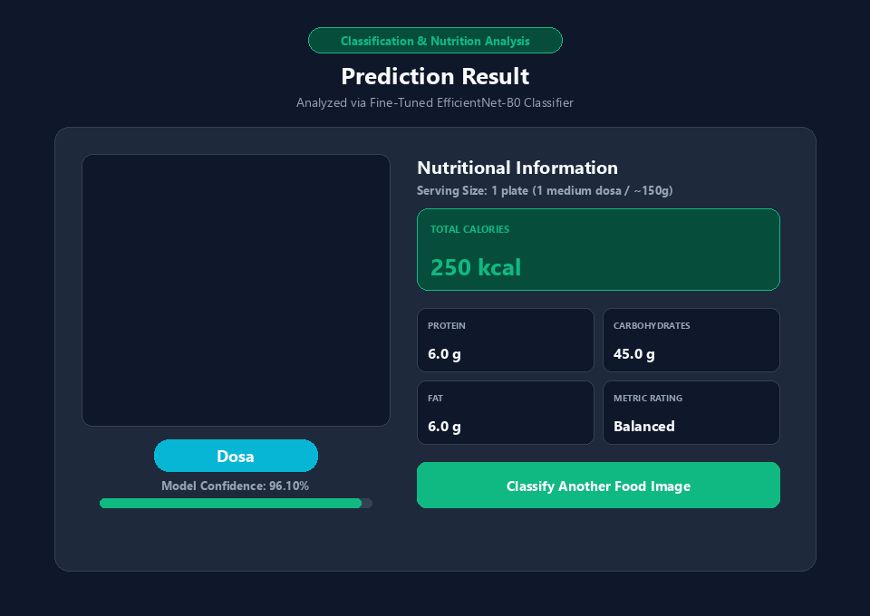
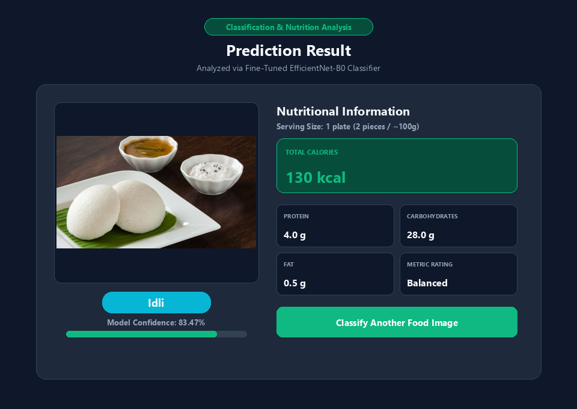

# AI Food Calorie & Nutrition Estimation

An end-to-end Computer Vision and Deep Learning application designed for college demonstration that classifies South Asian food images and provides automated nutrition estimation based on local serving data.

---

## 📌 Short Project Description

Tracking daily calorie and nutrient intake is important for health management. This project implements a lightweight image-based food classification pipeline. When a user uploads a photo of a supported food item, the system processes the image using a fine-tuned **EfficientNet-B0** deep learning model, predicts the dish category along with a confidence score, and retrieves its corresponding nutritional information per standard serving size.

---

## 🌐 Live Demo

Experience the live application deployed on Render:

[🚀 Live Demo](https://deep-learning-ap09.onrender.com/)

---

## 🖼️ Demo Screenshots

### Homepage & Image Upload Interface


### Food Prediction & Nutrition Result Examples

#### 1. Biryani Prediction Result


#### 2. Dosa Prediction Result


#### 3. Idli Prediction Result


---

## 🚀 Key Features

- **Automated Food Image Classification**: Fast image classification trained on South Asian food dishes.
- **Fine-Tuned Deep Learning Backbone**: Uses a fine-tuned EfficientNet-B0 model achieving **88.33% validation accuracy**.
- **Instant Local Nutrition Lookup**: Retrieves standard serving metrics (Calories, Protein, Carbohydrates, Fat) from a local database without external network calls.
- **Interactive Flask Web Application**: Simple, clean, and responsive drag-and-drop web interface built using Flask, HTML, and CSS.
- **Command Line Interface (CLI)**: Alternate inference script for quick terminal-based prediction.
- **Zero External API/Database Dependency**: Operates 100% locally with zero cloud, user login, or tracking overhead.

---

## 🍛 Supported Food Classes

The system strictly supports the following **6 food classes**:

1. **Dosa**
2. **Idli**
3. **Biryani**
4. **Chapati**
5. **Poori**
6. **Sambar**

*Note: Foods outside these 6 supported classes are not recognized by this model.*

---

## 🛠️ Technology Stack

- **Programming Language**: Python
- **Web Framework**: Flask
- **Deep Learning Framework**: PyTorch (Torchvision)
- **Model Architecture**: EfficientNet-B0
- **Image Processing**: OpenCV / Pillow (PIL)
- **User Interface**: HTML5 & CSS3

---

## 🔄 How It Works

```text
+-----------------------+
|  1. Upload Image      |  User selects or drops a food photo (JPG, PNG, WEBP)
+-----------+-----------+
            |
            v
+-----------------------+
| 2. Food Classification|  Fine-tuned EfficientNet-B0 predicts dish class
+-----------+-----------+
            |
            v
+-----------------------+
| 3. Confidence Score   |  Model calculates confidence percentage (%)
+-----------+-----------+
            |
            v
+-----------------------+
| 4. Nutrition Info     |  Local lookup database retrieves serving metrics
+-----------------------+
```

---

## 📊 Model Performance

- **Backbone Network**: Fine-tuned EfficientNet-B0 (pretrained on ImageNet)
- **Validation Accuracy**: **88.33%**
- **Training Strategy**: Transfer learning with global average pooling, AdamW optimizer, and data augmentation.

---

## 🥗 Nutrition Information

For each recognized dish, the system displays the following nutritional parameters per standard serving size:

| Food Class | Standard Serving Size | Calories (kcal) | Protein (g) | Carbohydrates (g) | Fat (g) |
| :--- | :--- | :--- | :--- | :--- | :--- |
| **Dosa** | 1 plate (1 medium dosa / ~150g) | 250 kcal | 6.0 g | 45.0 g | 6.0 g |
| **Idli** | 1 plate (2 pieces / ~100g) | 130 kcal | 4.0 g | 28.0 g | 0.5 g |
| **Biryani** | 1 plate (~300g) | 450 kcal | 18.0 g | 55.0 g | 16.0 g |
| **Chapati** | 1 plate (2 chapatis / ~80g) | 140 kcal | 4.0 g | 24.0 g | 3.0 g |
| **Poori** | 1 plate (2 pooris with bhaji / ~120g) | 300 kcal | 5.0 g | 35.0 g | 16.0 g |
| **Sambar** | 1 bowl (~200ml) | 110 kcal | 5.0 g | 18.0 g | 3.0 g |

---

## 📁 Project Folder Structure

```text
AI-Food-Calorie-Nutrition/
├── app.py                      # Flask web application server
├── requirements.txt            # Python dependency list
├── README.md                   # Project documentation
├── .gitignore                  # Git ignore rules
├── docs/                       # Project documentation assets
│   └── screenshots/            # Demo UI screenshots
│       ├── homepage.png
│       ├── prediction_biryani.png
│       ├── prediction_dosa.png
│       └── prediction_idli.png
├── src/                        # Core source code
│   ├── config.py               # Settings & path definitions
│   ├── dataset.py              # PyTorch Dataset & DataLoader
│   ├── model.py                # EfficientNet-B0 model builder
│   ├── nutrition.py            # Local nutrition database & lookup utility
│   ├── predict.py              # Single-image prediction & CLI
│   ├── prepare_dataset.py      # Dataset organizer & splitting
│   └── train.py                # Model training script
├── models/                     # Model weights
│   ├── food_classifier.pth           # Baseline checkpoint (~15.6 MB)
│   └── food_classifier_finetuned.pth # Fine-tuned primary model (~15.6 MB)
├── templates/                  # HTML templates
│   ├── index.html              # Upload homepage
│   └── result.html             # Prediction & nutrition result page
├── static/                     # Static web assets
│   ├── style.css               # Master stylesheet
│   └── uploads/                # Temporary image uploads (.gitkeep)
├── scripts/                    # Test & evaluation scripts
│   ├── compare_and_test.py
│   ├── test_nutrition.py
│   ├── test_flask_app.py
│   ├── test_error_handling.py
│   └── generate_demo_screenshots.py
└── dataset/                    # Dataset directory
    ├── train/                  # Training set split
    └── validation/             # Validation set split
```

---

## ⚡ How to Run Locally

1. **Navigate to the Project Directory**:
   ```bash
   cd "C:\Users\rithikesh 77\Downloads\RK Projects\deep-learning\AI-Food-Calorie-Nutrition"
   ```

2. **Install Dependencies**:
   ```bash
   pip install -r requirements.txt
   ```

3. **Start the Flask Web Demo**:
   ```bash
   python app.py
   ```

4. **Access in Web Browser**:
   Open `http://127.0.0.1:5000` in your web browser.

---

## ⚠️ Limitations

- **Supported Scope**: The classifier strictly supports only **6 food classes** (Dosa, Idli, Biryani, Chapati, Poori, Sambar). Unsupported food items will not be accurately recognized.
- **Approximate Estimates**: Nutritional values are reference approximations based on standard serving sizes and regional averages. Exact nutritional values vary depending on recipe ingredients, preparation methods, and portion sizes.

---

## 🔮 Future Improvements

- **Expanded Dataset**: Extend training data to cover additional regional and international food items.
- **Multi-Item Detection**: Implement Object Detection (such as YOLOv8) to identify multiple dishes present on a single plate.
- **Portion Weight Estimation**: Integrate depth estimation or reference object scaling to estimate food weight dynamically.
- **Mobile App Integration**: Deploy model via ONNX Runtime for Android and iOS mobile platforms.
