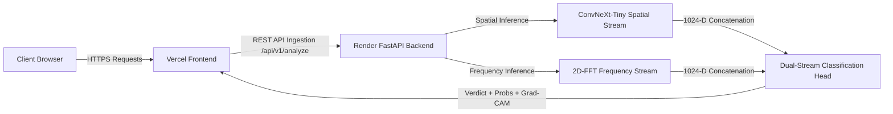

# SPECTRA FORENSICS — Production Deployment Guide

This guide details the complete, step-by-step production deployment process for the **Deepfake AI Image Detector** application.

---

## Architecture Overview



- **Frontend**: Vite + React SPA hosted on **Vercel**
- **Backend**: FastAPI + PyTorch Inference Service hosted on **Render**
- **Active Model Checkpoint**: `backend/models/deepfake_detector_improved.pth` (Validation ROC-AUC: 0.9740, F1: 0.9007)

---

## 1. Backend Deployment (Render)

### Configuration for Monorepo Setup (Recommended)
1. Log in to [Render Dashboard](https://dashboard.render.com/).
2. Click **New +** $\to$ **Web Service**.
3. Connect your GitHub repository: `https://github.com/rithikesh18-rk/deep-learning`.
4. Configure the service settings:

| Setting | Value | Note |
| :--- | :--- | :--- |
| **Name** | `deepfake-detector-api` | Or any unique name |
| **Region** | `Oregon (US West)` | Or nearest region |
| **Branch** | `main` | Production branch |
| **Root Directory** | `DeepfakeAI-Image-Detector` | **Important:** Subfolder in the monorepo |
| **Runtime** | `Python 3` | Python 3.11.x runtime |
| **Build Command** | `pip install --upgrade pip && pip install -r backend/requirements.txt` | Installs dependencies from `backend/requirements.txt` |
| **Start Command** | `uvicorn app:app --app-dir backend --host 0.0.0.0 --port $PORT` | **Ensure it starts with `uvicorn` (not `vicorn`)** |
| **Health Check Path** | `/api/v1/health` | Automated uptime health check |

> [!IMPORTANT]
> **Check the Start Command Spelling**:
> Ensure the command is typed exactly as:
> `uvicorn app:app --app-dir backend --host 0.0.0.0 --port $PORT`
> (Do not accidentally truncate the leading `u`).

5. Add the following **Environment Variables** in the Render Dashboard:

| Key | Value | Description |
| :--- | :--- | :--- |
| `PYTHON_VERSION` | `3.11.8` | Recommended Python version |
| `CHECKPOINT_PATH` | `backend/models/deepfake_detector_improved.pth` | Explicit path to the trained improved model |
| `CORS_ORIGINS` | `https://your-frontend-app.vercel.app,http://localhost:5173` | Allowed frontend origins (comma-separated) |

6. Click **Create Web Service** (or **Manual Deploy** $\to$ **Clear build cache & deploy**).
7. Note down your production Render URL (e.g. `https://deepfake-detector-api.onrender.com`).

---

### Alternative: Root Directory Left Blank
If you leave the **Root Directory** empty in Render settings:
- **Build Command**: `pip install --upgrade pip && pip install -r DeepfakeAI-Image-Detector/backend/requirements.txt`
- **Start Command**: `uvicorn app:app --app-dir DeepfakeAI-Image-Detector/backend --host 0.0.0.0 --port $PORT`

---

## 2. Frontend Deployment (Vercel)

1. Log in to [Vercel Dashboard](https://vercel.com/).
2. Click **Add New...** $\to$ **Project**.
3. Import your GitHub repository: `https://github.com/rithikesh18-rk/deep-learning`.
4. Configure the project settings:

| Setting | Value |
| :--- | :--- |
| **Framework Preset** | `Vite` |
| **Root Directory** | `DeepfakeAI-Image-Detector/frontend` |
| **Build Command** | `npm run build` |
| **Output Directory** | `dist` |
| **Install Command** | `npm install` |

5. Configure **Environment Variables** in Vercel:

| Key | Value | Description |
| :--- | :--- | :--- |
| `VITE_API_URL` | `https://deepfake-detector-api.onrender.com` | Your Render backend URL (no trailing slash) |

6. Click **Deploy**.
7. Once deployed, copy your production Vercel domain (e.g. `https://spectra-forensics.vercel.app`) and update `CORS_ORIGINS` in your Render backend settings if needed.

---

## 3. Production Health & Verification

Once deployed, verify the live endpoints:

### Health Check:
```bash
curl -X GET https://deepfake-detector-api.onrender.com/api/v1/health
```
**Expected JSON Response:**
```json
{
  "status": "healthy",
  "model_loaded": true,
  "model_type": "DualStreamForensicNet (ConvNeXt-Tiny + 2D-FFT)",
  "checkpoint_loaded": true,
  "checkpoint_path": "/opt/render/project/src/DeepfakeAI-Image-Detector/backend/models/deepfake_detector_improved.pth",
  "model_status": "trained_checkpoint_loaded",
  "device": "cpu"
}
```

### Forensic Analysis:
```bash
curl -X POST https://deepfake-detector-api.onrender.com/api/v1/analyze \
  -F "file=@test_images/6_ai_generated_diffusion.jpg"
```
**Expected JSON Response:**
```json
{
  "verdict": "AI-GENERATED",
  "ai_probability": 87.64,
  "confidence": 87.64,
  "artifact_flags": [],
  "fft_spectrum_base64": "data:image/png;base64,iVBORw...",
  "gradcam_heatmap_base64": "data:image/png;base64,iVBORw...",
  "model_status": "trained_checkpoint_loaded",
  "checkpoint_loaded": true,
  "metrics": {
    "peak_zscore": 4.20,
    "top_1pct_diff": 75.39,
    "grid_spike_score": 0.0,
    "smooth_patch_ratio": 0.43,
    "r_squared": 0.993
  }
}
```

---

## 4. Local Development Testing

To run the full stack locally:

```bash
# Terminal 1: Backend
.\backend\venv\Scripts\uvicorn app:app --app-dir backend --host 0.0.0.0 --port 8000

# Terminal 2: Frontend
cd frontend
npm run dev
```

Visit: `http://localhost:5173/`
