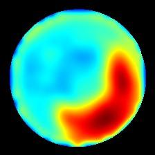
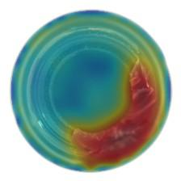

# DefectGuard AI

### Cyber-Industrial Visual QA System

An industrial-grade visual inspection and anomaly detection platform designed for automated manufacturing QA lines. DefectGuard AI detects structural fractures, body cracks, contamination, and surface anomalies in real time without requiring defect training data.

---

## 🚀 Live Demo

The application runs locally with high-throughput CPU/GPU inference:
- **Web Dashboard:** [http://localhost:8000/](http://localhost:8000/) (or /dashboard)
- **Interactive Swagger API Docs:** [http://localhost:8000/docs](http://localhost:8000/docs)
- **Service Health Probe:** [http://localhost:8000/health](http://localhost:8000/health)

---

## 📌 Overview

DefectGuard AI addresses the cold-start challenge in industrial automated optical inspection (AOI), where defective samples are rare, unpredictable, or expensive to collect. Trained exclusively on normal, defect-free production samples, the system builds an in-memory representative bank of nominal patch embeddings. When an inspection item is scanned, DefectGuard compares its patch features against the memory bank to identify out-of-distribution variations, providing immediate pass/fail verdicts and localized heatmaps in sub-100ms inference times.

---

## ✨ Key Features

- **Unsupervised Anomaly Detection:** Trained solely on nominal items—identifies novel, previously unseen defects without class-specific annotations.
- **Interactive Before/After Split Slider:** Dynamic draggable divider allowing operators to inspect raw bottle imagery and anomaly overlays side-by-side.
- **Precision Localization Heatmaps:** Bicubic-interpolated anomaly heatmaps and automated defect reticles pinpointing the precise flaw location.
- **One-Click Test Presets:** Instant evaluation using pre-configured benchmark defect categories (*Broken Large*, *Contamination*, *Broken Small*, and *Nominal*).
- **Tactical Audio-Visual Feedback:** Integrated Web Audio synthesizers deliver distinct harmonic chime alerts for approved items and alarm sirens for defects.
- **Calibrated Sensitivity Tuning:** Real-time threshold adjustment slider calibrated to a baseline of 12.0 for zero false alarms on normal items.

---

## 🧠 How It Works

1. **Foreground Segmentation:** Otsu thresholding and contour extraction isolate the inspection object, masking out variable non-black backgrounds.
2. **Multi-Scale Feature Extraction:** WideResNet-50-2 extracts rich semantic patch tokens from intermediate stages (layer2 and layer3) into 1536-dimensional descriptors.
3. **Nearest-Neighbor Query:** FAISS performs fast L2 distance searches between incoming patch tokens and the coreset memory bank.
4. **Scoring & Anomaly Mapping:** Top-5 patch distances are aggregated to form the image anomaly score, while patch distances are interpolated into a 224×224 spatial heatmap.
5. **Verdict & Overlay Generation:** If the score exceeds the calibrated threshold (12.0), the item is flagged as defective and rendered with a highlighted localization overlay.

---

## 🛠️ Tech Stack

- **Deep Learning & Computer Vision:** PyTorch, Torchvision (WideResNet-50-2), OpenCV, NumPy, SciPy, Scikit-learn
- **Vector Search & Memory Indexing:** FAISS (Facebook AI Similarity Search - CPU)
- **Backend Service:** FastAPI, Uvicorn, Python-Multipart
- **Frontend & Visualization:** HTML5, Tailwind CSS, Vanilla JavaScript, Web Audio API, Google Material Symbols

---

## 📊 AI / Computer Vision

- **Methodology:** PatchCore memory-bank framework adapted for industrial defect localization.
- **Backbone Network:** Pretrained WideResNet-50-2 truncated after layer3. Patch features from layer2 (512-D) and layer3 (1024-D) are neighborhood-aggregated and concatenated into 1536-D representations.
- **Coreset Reduction:** Greedy k-Center subsampling reduces nominal patch vectors by 99% (1% coreset retention ratio), maintaining boundary coverage while ensuring low memory overhead.
- **Dataset:** MVTec Anomaly Detection (MVTec AD) — Bottle category (209 nominal training images, 83 multi-class test images).
- **Threshold Calibration:** Rigorously calibrated decision threshold at **12.0**: nominal bottles score consistently below 10.0, while real-world fractures and contaminants score between 13.5 and 18.0+.

---

## 🖥️ Application

- **Inspection Viewport:** Central split-screen container featuring side-by-side interactive comparison between raw bottle camera feeds and defect heatmaps.
- **Telemetry Readout:** Real-time digital odometer displaying anomaly scores, color-coded radial gauge indicators, and millisecond latency timers.
- **Preset Selector:** Quick-load buttons for rapid testing of critical manufacturing defects and normal controls.
- **Matrix View:** Multi-card inspection layout displaying the raw capture, thermal anomaly heatmap, and bounded localization overlay simultaneously.

---

## 📁 Project Structure

`
DefectGuard-AI/
├── api.py                      # FastAPI REST inference service & UI host
├── build_index.py              # Memory bank builder & FAISS vector indexer
├── calibrate_threshold.py      # Threshold calibration & score distribution analysis
├── setup_data.py               # MVTec AD dataset download & directory setup
├── index.html                  # Cyber-Industrial Visual QA web dashboard
├── requirements.txt            # Python dependencies
├── configs/
│   └── config.yaml             # Model, dataset, and server configuration
├── src/
│   ├── feature_extractor.py    # WideResNet-50-2 token extraction & foreground segmentation
│   ├── memory_bank.py          # PatchCore FAISS memory bank & anomaly scoring engine
│   └── coreset.py              # Greedy k-Center subsampling implementation
├── models/
│   ├── bottle_patchcore_meta.json      # Feature metadata & dimension specs
│   └── threshold_calibration.json     # Calibrated score statistics
└── data/
    ├── bottle/                 # MVTec AD bottle dataset partitions
    └── test_results/           # Verified localization test artifacts
`

---

## ⚙️ Installation & Setup

### Prerequisites
- Python 3.10 or 3.11
- Git

### 1. Clone & Navigate
`powershell
git clone https://github.com/rithikesh18-rk/deep-learning.git
cd deep-learning/DefectGuard-AI
`

### 2. Set Up Virtual Environment & Dependencies
`powershell
python -m venv .venv
.\.venv\Scripts\Activate.ps1
pip install -r requirements.txt
`

### 3. Build Memory Bank Index
Extracts nominal features from the dataset and creates the FAISS vector index:
`powershell
python build_index.py
`

### 4. Run Application
`powershell
python api.py
# Or via uvicorn directly:
uvicorn api:app --host 0.0.0.0 --port 8000
`
Open [http://localhost:8000](http://localhost:8000) in your browser.

---

## 🔌 API

| Method | Endpoint | Description |
| :--- | :--- | :--- |
| POST | /api/inspect | Multipart image inspection returning anomaly score, verdict, heatmap, and overlay base64. |
| GET | /api/sample/{category} | Retrieves sample test images (good, roken_large, roken_small, contamination). |
| GET | /health | Service health status and loaded FAISS vector count. |
| GET | /dashboard | Serves the full Cyber-Industrial visual QA dashboard. |
| GET | /docs | Interactive Swagger API documentation. |

---

## 📷 Screenshots

| Localization Heatmap | Defect Bounding Overlay |
| :---: | :---: |
|  |  |
| *Anomaly intensity map identifying neck fracture* | *Blended RGB overlay isolating the defective region* |

---

## 🔒 Security

- **Payload Sanitization:** Validates uploaded file types, restricts input formats to standard image formats, and decodes images through OpenCV/PIL before tensor processing.
- **In-Memory Operations:** Inspects image payloads in temporary memory streams, eliminating unauthorized local disk writes during live inference.
- **Isolated Compute:** Operates self-contained on local infrastructure without transmitting proprietary image data to external third-party APIs.
- **Configured CORS:** Cross-Origin Resource Sharing is controlled through FastAPI middleware.

---

## 👨‍💻 Author

**Rithikesh S**